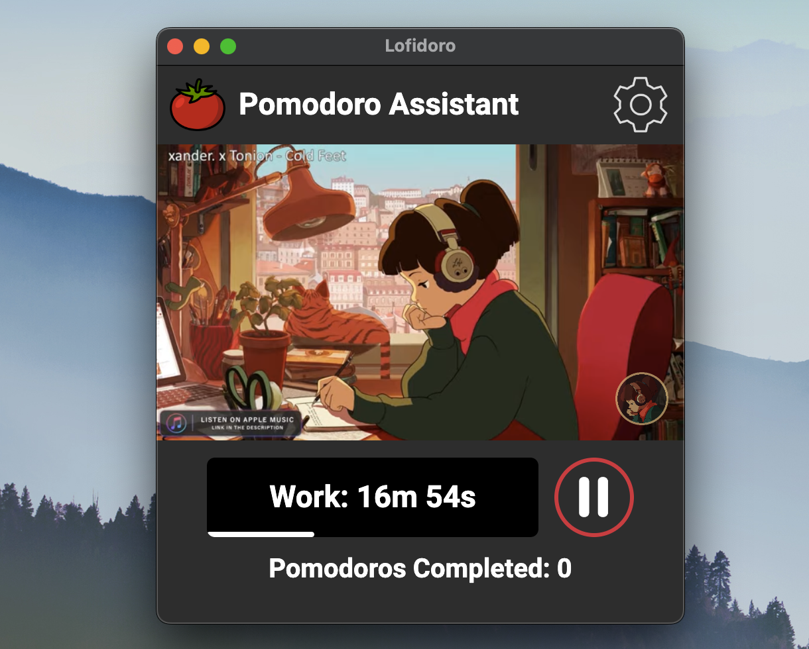
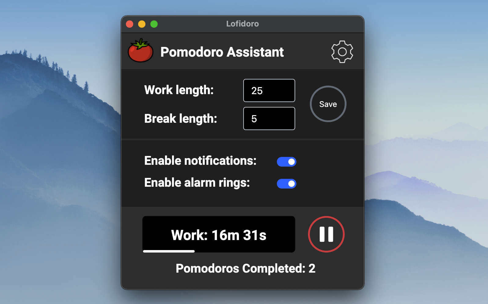

# lofi-pomodoro-chrome-extension

A pomodoro technique timer assistant chrome extension which also streams lofi music from https://www.youtube.com/watch?v=5qap5aO4i9A

The extension can be added to your Google chrome browser through the Chrome Web Store [link](https://chrome.google.com/webstore/detail/lofidoro/pjgoihdbljhplcmojnnfokmacpoonnee).

Alternatively, to run the chrome extension without downloading from the Chrome Web Store:
1. Download the extension
1. Navigate to chrome://extensions/ in the Google chrome browser
2. Enable Developer Mode from the top right corner
3. Click Load unpacked
4. Select the directory of the lofidoro extension
5. Click on the puzzle icon in the top bar of the chrome browser
6. Select Lofidoro
7. The extension should pop up.

Demo

Settings opened
